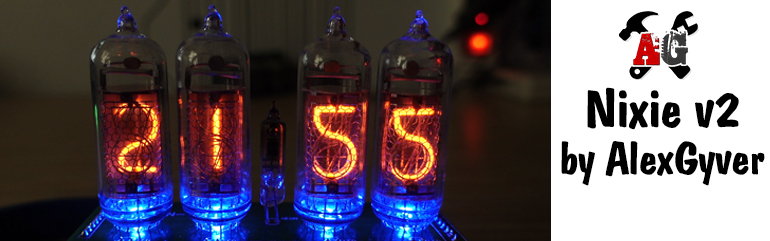
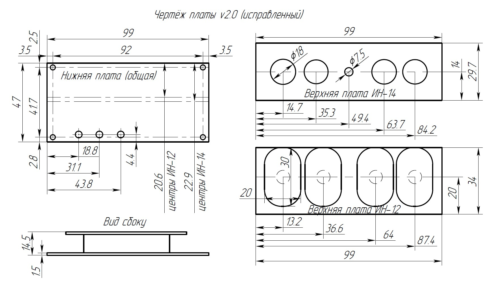

**WARNING: this README has been translated into English using Google Translate for ease of understanding - it may not make perfect sense**

# Clock on gas discharge indicators and Arduino
* [Project Description](#description-of-the-project)
* [Project folders](#folders)
* [Connection diagrams](#scheme)
* [Materials and components](#materials-and-components)
* [How to download and flash](#how-to-download-and-flash)
* [FAQ](#faq)
* [Useful information](#helpful-information)

## Description of the project
Clock on Soviet gas-discharge indicators under the control of the Arduino platform, version 2.
Project page on the website: https://alexgyver.ru/nixieclock_v2/

I decided to make the simplest and most affordable clock project on gas discharge indicators and Arduino! Single-sided board, output components, no tin!

Boards:
- The dimensions of the board are less than 100x100mm, that is, ordering 10 such boards from the Chinese will cost $ 2, excluding delivery
- The board is one-sided, it can be made into a classic LUT without any problems!
- All components are output, even a beginner can solder
- The number of components is reduced to a minimum!
- At the moment, the project has boards for indicators IN-12 and IN-14, perhaps others will be made
- The system consists of two boards: the bottom (all control electronics) and the top (lamps and backlight LEDs)
- There are two options for the lower boards: normal (4 optocouplers, dot - LED) and with an additional optocoupler for a neon dot (5 optocouplers, dot - neon)
- The boards IN-14, IN-12, IN-12_changeling have the same lower part! Parts of the boards are interchangeable. The bottom board is different only for IN-14_neon  

Hardware chips:
- The heart of the board is a full size Arduino NANO, which means easy assembly and firmware
- Power supply of the entire circuit - 5 Volts
- The high voltage generator is driven by the Arduino PWM channel
- The generator voltage is adjusted by a resistor with a twist
- Time sets RTC DS3231
- 3 buttons to set time and alarm
- Alarm buzzer
- Illumination of indicator lamps
- The project is based on Andrey Zheleznyakov's board. Thank you! Link to the project: https://goo.gl/xTVQWP  

Software features:
- “Search” of numbers, preventing the indicators from oxidizing
- Alarm mode
- Smooth change in the brightness of the dot and backlight ("breathing" effect)
	+ Advanced settings for smooth breathing
- Setting the brightness of numbers, “points” and lamp illumination
	+ Two brightness modes depending on the time of day
- Different modes of switching indicators
	+ Smooth fade in/out
	+ Numeric brute force
	+ Enumeration of cathodes

## Folders
**ATTENTION! If this is your first experience with Arduino, read the [manual](#chapter-4)**
- **libraries** - project libraries. Replace existing versions (there are no external libraries in this project)
- **firmware** - firmware for Arduino
- **schemes** - component connection diagrams

## Scheme
Boards:
- IN-14 - for indicators IN-14 with LED dot https://easyeda.com/editor#id=1d7c359f88254c9d9c7ce9de914bd4c5
- IN-14_mini_neon_dot - for IN-14 with dot - indicator (+1 optocoupler and resistor) https://easyeda.com/editor#id=be6c3cd8d42a414b8a8e5b9bdd0401bf
- IN-12 - for IN-12, the numbers are upside down (when looking at the board) https://easyeda.com/editor#id=1d7c359f88254c9d9c7ce9de914bd4c5
- IN-12_turned - for IN-12, numbers are turned correctly https://easyeda.com/editor#id=aea22745380847b5beeca679820e7565  

By opening the board via the link, it can be exported to PDF, PNG or Altium (folder icon on the top left / export) for manufacturing by LUT or other methods!  
When ordering boards from the Chinese, do not forget to indicate in the comment "Please make V-cut along middle thick horizontal outline" to cut the board along the middle line  
**Gerber files are already in the archive!**

## Materials and components
### Links are left to stores from which I have been buying for more than one year
- Arduino NANO Rev3.0 https://ali.ski/670JrC https://ali.ski/_7IUJ
- RTC DS3231 https://ali.ski/gOYYG0
- Squeaker https://ali.ski/8LEYlE
- Sockets for the board https://www.chipdip.ru/product/pbs-40
- Pin rail https://www.chipdip.ru/product/pls-40
- Electrolytic capacitor 4.7 uF 350V https://www.chipdip.ru/product0/33635
- Trimmer resistor 470 kOhm (can be 500 kOhm) https://www.chipdip.ru/product/3362p-1-504
- Inductance 220 uH (uH) https://www.chipdip.ru/product/ec24-221k
- Diode HER106 https://www.chipdip.ru/product/her106
- Transistor IRF840PBF https://www.chipdip.ru/product/irf840
- Optocoupler TLP627(F) DIP-4 https://www.chipdip.ru/product/tlp627
- Decoder K155ID1 https://www.chipdip.ru/product/k155id1
- Resistors 0.25 W for version IN12/IN14 with LED dot
	- 150 Ohm
	- 470 Ohm
	- 10 kOhm	
	- 100 Ohm - 3pcs	
- Resistors 0.25 W for version IN14 with neon dot
	- 200 kOhm
	- 470 Ohm
	- 10 kOhm	
	- 100 Ohm - 3pcs

## You will most likely need
* [All for soldering (soldering irons and gadgets)](http://alexgyver.ru/all-for-soldering/)
* [Inexpensive tools](http://alexgyver.ru/my_instruments/)
* [All existing Arduino modules and sensors](http://alexgyver.ru/arduino_shop/)
* [Electronic components](http://alexgyver.ru/electronics/)
* [Batteries and charging modules](http://alexgyver.ru/18650/)

## How to download and flash
* [First steps with Arduino] (http://alexgyver.ru/arduino-first/) - an ultra detailed article on getting started with Arduino, read it first!
* Download the archive with the project
> On the main page of the project (where you are reading this text) at the top right there is a green button **Clone or download**, click it, there will be **Download ZIP**
* Install libraries in  
`C:\Program Files (x86)\Arduino\libraries\` (Windows x64)  
`C:\Program Files\Arduino\libraries\` (Windows x86)
* **Connect external power supply 5 Volt**
* Connect Arduino to computer
* Run the firmware file (which has the .ino extension)
* Configure IDE (COM port, Arduino model, as in the article above)
* Customize what you need for the project
* Click download
* Enjoy  

## FAQ

### Main questions
Q: How to download from this fucking site?  
A: On the main page of the project (where you are reading this text) there is a green button **Clone or download** at the top right, click it, there will be **Download ZIP**

Q: Some .zip file was downloaded, where is it now?  
A: This is an archive. You can open it using standard Windows tools, but I think everyone has WinRAR installed on their computer, you need to right-click the archive and extract it.

Q: I'm a total newbie! What should I do with Arduino, where can I get all the programs?  
A: Read and watch the video http://alexgyver.ru/arduino-first/

Q: Loading / compilation error crashes!
A: Read here: https://alexgyver.ru/arduino-first/#step-5

Q: How much does it cost?  
A: I don't sell anything.

### Questions about this project

## Helpful information
* [My site](http://alexgyver.ru/)
* [Main YouTube channel](https://www.youtube.com/channel/UCgtAOyEQdAyjvm9ATCi_Aig?sub_confirmation=1)
* [YouTube channel about Arduino](https://www.youtube.com/channel/UC4axiS76D784-ofoTdo5zOA?sub_confirmation=1)
* [My soldering video tutorials](https://www.youtube.com/playlist?list=PLOT_HeyBraBuMIwfSYu7kCKXxQGsUKcqR)
* [My video tutorials on Arduino](http://alexgyver.ru/arduino_lessons/)
